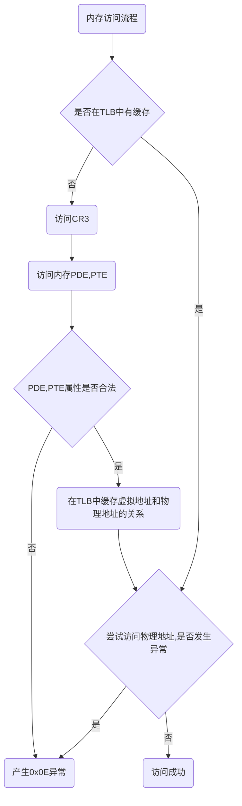

[toc]

# Windows内核实验13——数据TLB

## 实验准备

### 内存访问流程





### 要求

1. 确保指令一条接一条执行（不产生页面异常）。
2. 确保要测试的虚拟地址已经存放在TLB中（最近的内存访问）。
3. “刷新”TLB实际上是“使无效”TLB，不访问内存。

## 代码

- 验证TLB存在

  ```c++
  #include <iostream>
  #include <Windows.h>
  
  
  #define PTE(x) ((DWORD*)(0xc0000000 + ((x >> 12) << 3)))
  #define PDE(x) ((DWORD*)(0xc0600000 + ((x >> 21) << 3)))
  
  DWORD old_pte[2];
  DWORD g_out = 0;
  #pragma section("data_seg",read,write)
  __declspec(allocate("data_seg"))    DWORD page1[1024];      // 0x0041b000
  __declspec(allocate("data_seg"))    DWORD page2[1024];      // 0x0041c000
  
  //0x00401040
  void __declspec(naked) IdtEntry1()
  {
      __asm mov eax, ds: [0x0041c000]  // 确保地址存在于TLB缓存中
  
      old_pte[0] = PTE(0x0041c000)[0];    // 保存page2的pte
      old_pte[1] = PTE(0x0041c000)[1];
  
      PTE(0x0041c000)[0] = PTE(0x0041b000)[0];    // 将page2挂在到page1的物理内存上
      PTE(0x0041c000)[1] = PTE(0x0041b000)[1];
  
      //__asm
      //{
      //    mov eax, cr3            // 刷新TLB，验证TLB的存在
      //    mov cr3, eax
      //}
      
      g_out = page2[0];
  
      PTE(0x0041c000)[0] = old_pte[0];    // 如果不恢复PTE，程序结束时释放内存会造成double free
      PTE(0x0041c000)[1] = old_pte[1];
  
      __asm
      {
  
  
          iretd
      }
  }
  
  void go()
  {
      page1[0] = 1;       // 确保物理地址存在
      page2[0] = 2;
      __asm int 0x20
  }
  
  // eq 8003f500 0040ee0000081040
  int main()
  {
      if ((DWORD)IdtEntry1 != 0x401040)
      {
          printf("IdtEntry1 addr: %p\n", IdtEntry1);
          exit(-1);
      }
      system("pause");
      go();
      printf("g_out: %p\n", g_out);
      system("pause");
  }
  
  ```

  > 上面代码执行时，g_out = 2，按照程序的逻辑来说，已经将page2的虚拟地址挂在page1的物理内存上，结果应该page2这个虚拟地址对应的物理地址应该为page1的物理地址，page2[0] = page[0] = 1，结果打印的却是2。
  >
  > 去掉刷新TLB汇编代码，再次执行，结果就是1.
  >
  > 原因在于，虽然修改PTE，但是TLB中有page2的缓存，他就不会从PTE那种方式去访问物理内存，而是直接从TLB中获取page2物理地址，刷新TLB以后，回事TLB中page2的缓存失效，查找不到，就会从PTE的方式获取物理内存地址，导致结果恢复正常

- TLB G位刷新 

  ```c++
  // IdtEntry.cpp : 此文件包含 "main" 函数。程序执行将在此处开始并结束。
  //
  
  #include <iostream>
  #include <Windows.h>
  
  
  #define PTE(x) ((DWORD*)(0xc0000000 + ((x >> 12) << 3)))
  #define PDE(x) ((DWORD*)(0xc0600000 + ((x >> 21) << 3)))
  
  DWORD old_pte[2];
  DWORD g_out = 0;
  #pragma section("data_seg",read,write)
  __declspec(allocate("data_seg"))    DWORD page1[1024];      // 0x0041b000
  __declspec(allocate("data_seg"))    DWORD page2[1024];      // 0x0041c000
  
  //0x00401040
  void __declspec(naked) IdtEntry1()
  {
      
  
      old_pte[0] = PTE(0x0041c000)[0];    // 保存page2的pte
      old_pte[1] = PTE(0x0041c000)[1];
  
      PTE(0x0041c000)[0] = PTE(0x0041b000)[0] | 0x100;    // 将page2挂在到page1的物理内存上,设置G位
      PTE(0x0041c000)[1] = PTE(0x0041b000)[1];
  
      __asm
      {
          mov eax, cr3            // 刷新TLB，此时的page2没有G位，上面只是修改内存
          mov cr3, eax
      }
      __asm mov eax, ds: [0x0041c000]  // 确保地址存在于TLB缓存中
  
      PTE(0x0041c000)[0] = old_pte[0];    // 如果不恢复PTE，程序结束时释放内存会造成double free
      PTE(0x0041c000)[1] = old_pte[1];
  
      __asm
      {
          mov eax, cr3            // 刷新TLB，此时TLB中的page2已经有了G位
          mov cr3, eax
      }
  
      g_out = page2[0];
  
  
      __asm
      {
  
          iretd
      }
  }
  
  void go()
  {
      page1[0] = 1;       // 确保物理地址存在
      page2[0] = 2;
      __asm int 0x20
  }
  
  // eq 8003f500 0040ee0000081040
  int main()
  {
      if ((DWORD)IdtEntry1 != 0x401040)
      {
          printf("IdtEntry1 addr: %p\n", IdtEntry1);
          exit(-1);
      }
      system("pause");
      go();
      printf("g_out: %p\n", g_out);
      system("pause");
  }
  
  ```

  > 注释掉设置G位的0x100，打印结果为2，去掉注释，正常设置G位以后打印的结果位1。
  >
  > **重点：**TLB刷新时如果页属性中有G位，它就不会让这个页缓存失效。
  >
  > 原因：
  >
  > 1. 注释掉设置G位的情况。第一次刷新TLB时，此时page2在TLB中缓存失效，接着访问page2页面，让TLB中增加page2的缓存，此时TLB中的page没有G位，然后将page2的PTE恢复，再一次刷新缓存，此时TLB中又一次导致page2的缓存失效再次访问page2的地址是采用的PTE的方式获取物理地址，导致打印结果位2
  > 2. 去掉注释，正常设置了G位的情况。第一次刷新TLB时，缓存中的page2没有G位，因为刚刚修改的是PTE，而不是TLB缓存，此时page2在TLB中缓存失效，接着访问page2页面，让TLB中增加page2的缓存，此时TLB中的page2依然增加G位，然后将page2的PTE恢复，再一次刷新缓存，此时TLB缓存中page2有G位，不再导致page2的缓存失效，所以打印的结果为1

- 强制刷新TLB，无视G位

  ```c++
  // IdtEntry.cpp : 此文件包含 "main" 函数。程序执行将在此处开始并结束。
  //
  
  #include <iostream>
  #include <Windows.h>
  
  
  #define PTE(x) ((DWORD*)(0xc0000000 + ((x >> 12) << 3)))
  #define PDE(x) ((DWORD*)(0xc0600000 + ((x >> 21) << 3)))
  
  DWORD old_pte[2];
  DWORD g_out = 0;
  #pragma section("data_seg",read,write)
  __declspec(allocate("data_seg"))    DWORD page1[1024];      // 0x0041b000
  __declspec(allocate("data_seg"))    DWORD page2[1024];      // 0x0041c000
  
  //0x00401040
  void __declspec(naked) IdtEntry1()
  {
      
  
      old_pte[0] = PTE(0x0041c000)[0];    // 保存page2的pte
      old_pte[1] = PTE(0x0041c000)[1];
  
      PTE(0x0041c000)[0] = PTE(0x0041b000)[0] | 0x100;    // 将page2挂在到page1的物理内存上,设置G位
      PTE(0x0041c000)[1] = PTE(0x0041b000)[1];
  
      __asm
      {
          mov eax, cr3            // 刷新TLB，此时的page2没有G位，上面只是修改内存
          mov cr3, eax
      }
      __asm mov eax, ds: [0x0041c000]  // 确保地址存在于TLB缓存中
  
      PTE(0x0041c000)[0] = old_pte[0];    // 如果不恢复PTE，程序结束时释放内存会造成double free
      PTE(0x0041c000)[1] = old_pte[1];
  
      __asm invlpg ds: [0x0041c000]
  
      g_out = page2[0];
  
      __asm
      {
          iretd
      }
  }
  
  void go()
  {
      page1[0] = 1;       // 确保物理地址存在
      page2[0] = 2;
      __asm int 0x20
  }
  
  // eq 8003f500 0040ee0000081040
  int main()
  {
      if ((DWORD)IdtEntry1 != 0x401040)
      {
          printf("IdtEntry1 addr: %p\n", IdtEntry1);
          exit(-1);
      }
      system("pause");
      go();
      printf("g_out: %p\n", g_out);
      system("pause");
  }
  
  ```

  > 打印结果为2。
  >
  > 原因：这个TLB的缓存中Page2的属性有G位，但是后面的指令就是强制刷新该页，即使有G位也会刷新，导致该页的缓存失效。

## 应用

在内核函数所在的页都有G属性，所以在对内核函数inline hook 时，要给对应的页修改为可写权限(此时才能liline hook)，为了修改的权限及时生效，就需要强制刷新TLB